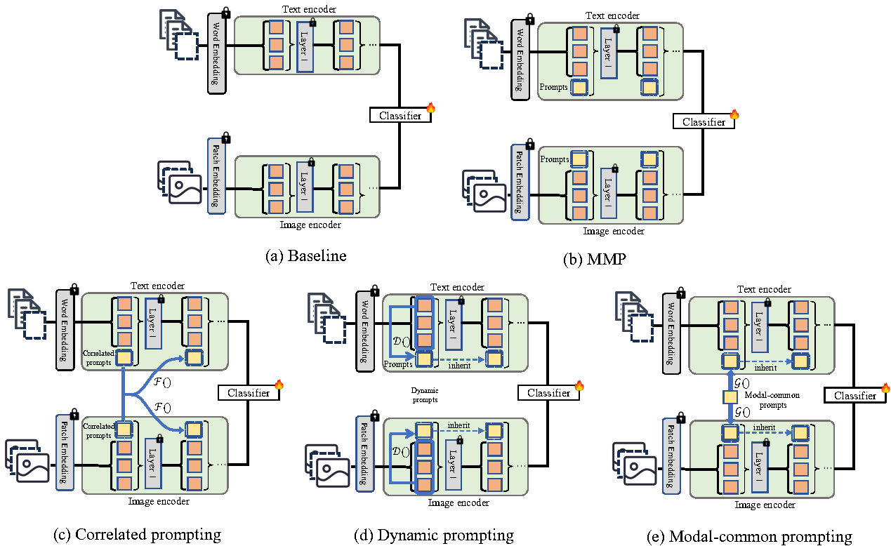
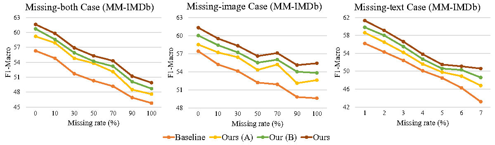

# Deep Correlated Prompting for Visual Recognition with Missing Modalities (NeurIPS 2024)
Official PyTorch implementaton of NeurIPS 2024 paper "[Deep Correlated Prompting for Visual Recognition with Missing Modalities](https://arxiv.org/abs/2410.06558)".  

## Introduction
In this paper, we tackle two main challenges in multimodal learning, including (1) any modality may be missing in any learning phase (e.g., training, testing or both), and (2) how to efficiently adapt large-scale multimodal transformers to fit missing-modality cases under constrained computing resources. Previous methods ([MMP](https://arxiv.org/abs/2303.03369)) have considerably explored this issue. However, it only assigns independent prompts to the input and intermediate features, which (1) fails to consider the relationships between prompts of different layers, and (2) lacks the correlations between prompts and input features, and (3) overlooks the complementarity of multimodal inputs. To better adapt the pretrained multimodal model for missing-modality scenarios, we propose to design three types of missing-aware prompts by capturing the relationships between prompts and inputs. Compared to MMP, our method could achieve much better performance across a wide range of bekchmarks. Specifically, our modality-missing-aware prompts can be plugged into multimodal transformers to handle general missing-modality cases, while only requiring less than 4% learnable parameters compared to training the entire model. Our model trained on one missing-modality case (missing-all) can show superior performance over all missing-modality cases (e.g., missing-all, missing-image and missing-text).

<div align="center">
  
</div>

## Performance
By equipping each proposed prompting design, our method obtains notable performance gain. Taking the results on the MMIMDb dataset as an example, our method achieves superior performance over all missing-modality cases (e.g., missing-all, missing-image and missing-text).

<div align="center">
  
</div>

## Usage
### Enviroment
#### Prerequisites
```
pip install -r requirements.txt
```

### Prepare Dataset
We use three vision and language datasets: [MM-IMDb](https://github.com/johnarevalo/gmu-mmimdb), [UPMC Food-101](https://visiir.isir.upmc.fr/explore), and [Hateful Memes](https://ai.facebook.com/blog/hateful-memes-challenge-and-data-set/). Please download the datasets by yourself. We use `pyarrow` to serialize the datasets, the conversion codes are located in `vilt/utils/wirte_*.py`. Please see [`DATA.md`](./DATA.md) to organize the datasets, otherwise you may need to revise the `write_*.py` files to meet your dataset path and files. Run the following script to create the pyarrow binary file:
```
python make_arrow.py --dataset [DATASET] --root [YOUR_DATASET_ROOT]
```

### Implementation
The key implementations for our proposed method are located in the [clip_missing_aware_prompt_module.py](./clip/modules/clip_missing_aware_prompt_module.py) and [vision_transformer_prompts.py](./clip/modules/vision_transformer_prompts.py), which defines the prompting approaches and base modules, respectively.

### Train
```
python run.py with data_root=<ARROW_ROOT> \
        num_gpus=<NUM_GPUS> \
        num_nodes=<NUM_NODES> \
        per_gpu_batchsize=<BS_FITS_YOUR_GPU> \
        <task_finetune_mmimdb or task_finetune_food101 or task_finetune_hatememes> \
        exp_name=<EXP_NAME>
```
Example command:
```
python run.py with data_root=/path_to_mmimdb num_gpus=1 num_nodes=1 per_gpu_batchsize=4 task_finetune_mmimdb exp_name=exp_base
```
### Evaluation
```
python run.py with data_root=<ARROW_ROOT> \
        num_gpus=<NUM_GPUS> \
        num_nodes=<NUM_NODES> \
        per_gpu_batchsize=<BS_FITS_YOUR_GPU> \
        <task_finetune_mmimdb or task_finetune_food101 or task_finetune_hatememes> \
        load_path=<MODEL_PATH> \
        exp_name=<EXP_NAME> \
        prompt_type=<PROMPT_TYPE> \
        test_ratio=<TEST_RATIO> \
        test_type=<TEST_TYPE> \
        test_only=True     
```
Example command:
```
python run.py with data_root=/path_to_mmimd num_gpus=1 num_nodes=1 per_gpu_batchsize=4 task_finetune_mmimdb load_path=/path_to_your_pretrained.ckpt test_only=True test_ratio=0.7 test_type=both exp_name=exp_test
```
The `/path_to_your_pretrained.ckpt` could be the `.pt` file with prefix `epoch-` in the output folder.
## Citation
If you find this work useful for your research, please cite:
```Bibtex
@inproceedings{hu2024deep,
  title={Deep Correlated Prompting for Visual Recognition with Missing Modalities},
  author={Lianyu Hu,Tongkai Shi, Wei Feng, Fanhua Shang, Liang Wan},
  booktitle={Thirty-Eighth Annual Conference on Neural Information Processing Systems},
  year={2024},
}
```

## Acknowledgements
This code is based on [ViLT](https://github.com/dandelin/ViLT.git), [CLIP](https://github.com/openai/CLIP) and [MMP](https://github.com/yilunlee/missing_aware_prompts). Many thanks for their contributions. 
